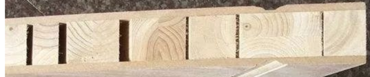
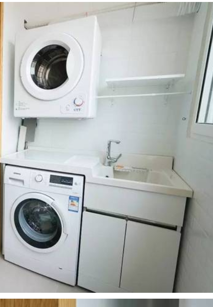
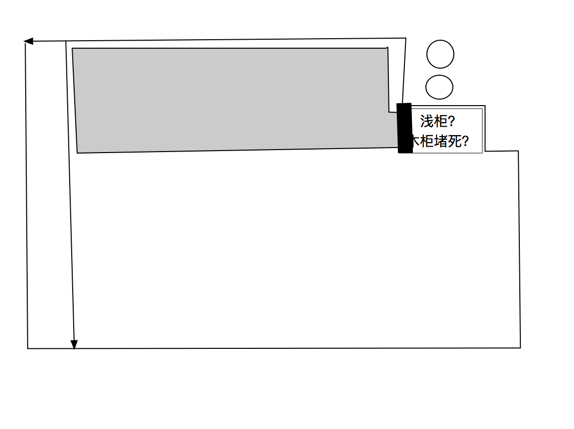

# 0416
1. 重新提交开户申请
2. 主卧衣柜加深柜体方案：做外挂移门，淘宝【玉清定制家居】和买木门的都可以做，继续了解价格、质量中

# 0415
1. 提交了燃气开通申请：被拒，购房合同页面拍摄不全

# 0414
1. 4张木饰面板用做餐桌背景墙，1160元，森鹿K7782板岩直纹 **这个叫【KD板木饰面】，淘宝上一堆70元/平米的，还是买贵了**
2. 烟道管+止逆阀，90元

# 0409
1. 最终墙纸候选：R544，SL317，TWP0370，9045，9442，8523，2225

# 0407
1. 基本确定好淋浴房玻璃移门，500元一平方
2. 糯米胶+基膜买好了：180平来买，嘉力丰9L糯米胶+12L基膜
3. 和橱柜老板确定橱柜的基本样式
4. 墙纸师傅：9.5元一平方（日本墙纸难贴）
    a. 总面积预估：主卧周长17，衣帽间8，次卧12，书房11，客餐厅25，一共73，2.6m层高，183，减去飘窗、3个卧室窗户、书房门洞、阳台窗户、鞋柜、冰箱、餐厅

# 0404
1. 泥木工验收（钉子没定牢、有瓷砖空鼓）
2. 门下单,35天做好
3. 橱柜、衣柜已量好
    1. 洗碗机（SJ636X03JC）尺寸（长宽高）：598*550*775
    2. 水槽（松下G76）尺寸：宽760mm，径深515mm，深度200mm
    3. 抽油烟机（CXW-220-25A7）：895宽*561高*424深
    4. 燃气灶（n3gq2rwtq1）

# 0319
1. 背景墙找更便宜的渠道：常见的油漆板800-1000一平，用双饰面板（18mm厚门板）300一平，用柳安芯夹板（3mm多层板）150一平

# 0316
1. 瓷砖老板进来重量尺寸
2. 空调外机吊装完成
3. 改变主意：做背景墙，餐桌两面墙+投影仪吊顶下部+电视机局部

# 0314
1. 吊顶放样
2. 瓷砖进场（厨房用的加工砖，图纸不对，老板回去改）
3. 纳米板、旋转鞋柜收货

# 0305-0308
1. 地暖找平（豆石找平不容易干，下周四再吊顶放样）

# 0227 豆石
1. 38元/50kg*33包, 包运费到家
2. 卫生间风暖浴霸买好了:1100元，项目经理包安装

# 0226 水电整改
1. 确认过了，补1000水电整改费用+800的泥工费用
2. 地暖安排了下周一进场，周日先和师傅在家里碰一下
3. 催瓷砖出厨房的效果图：周四出

# 0224 空调安装
1. 早上9点，叫设计师定位
2. 下周二水电整改（项目经理、设计师、电工师傅均到场，提前列好增改项打印）


# 0221 空调安装
1. 暖馨：1100*4包辅材，
2. 李师傅：650*4+辅材1300，
3. 地暖说好了下周约师傅

# 0217 节后水电
1. 豆石：浙江花卉市场，小袁园艺 13588779531
2. 浴霸：松下30BU3C
    a. 30BU3C（普通吊顶款）/30BUS3C（集成吊顶款）是线下款，和RB16只有面板不同

# 0215 投影仪
1. 投影仪布线参考：https://zhuanlan.zhihu.com/p/43001749
2. 参考【好好住-张芥凉】的方案：
3. 幕布120寸：金属/灰玻纤材质，淘宝销量最高买就行了（或者红叶牌子？完全不懂不同牌子之间有什么差别）大概尺寸已经给设计师了
4. 电视：65寸小米，挂墙后离墙10cm大概
5. hdmi线在一个线管里面部署2根，防坏；hdmi需要重新开槽

# 0210 节后重看下水电
1. 洗手台右侧的墙还没贴砖就只有50cm深，浴室柜是55cm进深的;洗手台没贴砖留了106cm宽，洗手台只有100cm宽，是否能完好贴住拿密封胶贴合？
2. 沙发上方没有预留投影仪的强电插座（还需要走hdmi线）
3. 阳台洗手池没有留小厨宝的插座、水管
4. 衣帽间角落没有水泥找平
5. 主卧门框的水泥开裂
6. 阳台的移门防撞再往里面移动？现在太窄了

# 0207 艾格特同款、投影仪布线
1. 阁室美、美达斯
2. 设计衣帽间的内容：大致尺寸2.4mx1.3m
3. **确定燃气灶款式：N3GQ2RWTQ1**，尺寸等说明书下载：https://www.n-techdocs.com/
4. 

# 0121 卫生间吊顶
1. 风暖浴霸装在马桶上方，不放在淋浴区上方，已同步设计师、项目经理，吊顶位置需要

# 0120 鞋柜示意图

1. 不设置放伞区域，伞放门外
2. 紫色方形：没铺地暖时，左侧2个插座，一个离地面125cm，一个离地面175cm
3. 黄色长条（常亮，需要接插座）：隐藏灯带，2个灯带接线连，下方引出一个插头插到右边的绿色插座
4. 底部左侧有一个插座（棕色），用来给扫地机器人充电
5. 粉色长条（感应，直接接红蓝线）：隐藏感应灯带，直接接右方的红蓝线

# 0119 水电验收问题
1. 弱电箱上方的管子用锡纸包住
2. 强电有几处不规范需要改造
3. 洗手池的水管增加坡度
4. 前置净水器的入水有漏水现象
5. 阳台的2处下水管（台盆、洗衣机）都不能用90度的水管，需要改成45度的下水管
6. 鞋柜改造：旋转鞋柜放在右半，左侧添加2个插座
7. 地面找平：水电找平正常工艺；地暖层找平使用豆石（比例：水泥:沙子:豆石 = 1:2:3）
8. 床头柜的壁灯添加接地线

# 0118 准备水电验收
1. 水管：安装平直、接口无渗漏
2. 水管打压测试：0.6-0.8MPa，稳定30分钟，掉压不超过0.05MPa
3. 水管牢固，无明显松动
4. 冷热水管间距10cm以上
5. 水管、电线、燃气管间距10cm以上，开关插座距离燃气30cm以上
6. 龙头：左冷右热；
7. 下水管：接水看是否通畅
8. 电线：16管2.5平方小雨4根；20管4平方小于3根；
9. 强弱电交叉处锡管包，包超过30cm
10. 线盒里面的线一定要锁扣和胶固定好
11. 线头长度：一般15cm；灯口30-50cm；弱电箱50cm

# 0114 油烟机
1. 富士帝(太贵了，选华帝侧吸21L的)：
    a. 顶吸：CXW-220-FR100T（3500元，18-20L吸力，180出风，350风压，69db）
    b. 顶吸：CXW-218-FJ01 (3600元，16L，180出风，320风压)
    c. 侧吸：CXW-218-RX01（4000元，）

# 0113 空调安装-失败
1. 辅材还没到，没安装；孔先打了；水电、空调一共打了40个孔，600元
2. 半包补400元：200元净水器安装，200元燃气灶进水安装

# 0110 确定周日安装空调
1. 确定周日装空调（可能还是放在外机）
2. 水电方面，空调外机位走线先不定，后面再说

# 0109 弱电箱移位方案失败
1. 送网线、弱电箱过去
2. 弱电箱想移位到鞋柜里面，沟通了，不行
3. 监理完成了水电巡检

# 0105 重新购买空开漏保
1. 全部带漏保，大概1600
2. 双十一买的没带漏保，还在退货期（180天）退了；下次别提前买了。。。

# 0102 准备周六水电放样
1. 约好了监理，早上9点半到
2. 咨询物业管家：楼下联系方式、切书房水管
3. 联系槽钢：13958018645 吴老板
4. 咨询地暖+太阳能合用：应该可以，我的太阳能水箱就在侧卫生间旁边，比较近，周六和师傅现场确认

# 0101 水电放样-未完成
1. 墙没有砌好，昨天来看，砌墙师傅忘记把门加高了，拆掉还没有刮腻子
2. 空调安装师傅过来了，说外中央空安装需要放到侧卧外机位，需要找厂家假设槽钢从设备平台到外机位
3. 铲掉地面的保温层（质量不好）1000元+阳台墙漆、侧卧保温层铲掉400元

# 1231 水电放样注意事项
1. heatlink的零火线预留（不需要插座）
2. 镜柜右上角的电线预留
3. 联排的插座，间隔需要2-3cm
4. 吸顶AP的两头都是水晶头，怎么防止网线被抽出来了？
5. 花洒入水：左热右冷
常规注意事项：
1. 检测每个插座的高度、家居摆放阻挡与否
2. 每个线路的铜线平方数、空开？
6. 今天交了橱柜定金1000.年后量，量完之后要一个月才能安装

# 1230 水电改造
1. 增加插座：
    a. 厨房左上角增加2个插座：壁炉、heatlink（不需要插座，直接跳线？）；左边下柜1个（洗碗机）
    b. 进户门右手边增加一个插座（后期买鞋柜）
    c. 厨房左侧台面增加一个，一排4个

# 1223 
1. 敲墙谈好了，明天开工，预计周二弄好，一共1900元：单墙40/平，厚墙50/平，飘窗400
2. 花了弱电图：


# 1222 退货
1. 退一个吸顶灯：
2. 不需要换：客厅13个筒灯，洗手间3个筒灯，厨房4个，衣帽间3个，卧室4个黄色筒灯，2个小夜灯
3. 需要8条弱点线路，16个水晶头，还差10个：
4. 退空调插座：3个
5. 退2个单开双控、2个双开单控

# 1213 停工改方案
1. [住宅室内装饰装修管理办法](http://www.china.com.cn/chinese/PI-c/139736.htm)
2. 几个问题导致没有动工：砌墙面积

# 1211 
1. 早上办了开工仪式
2. 约了燃气师傅周末过来看
3. 签了半包合同，40%的定金

# 1210 好美家木门进度
1. 木门颜色：
2. 地板大板价格：
3. 踢脚线：
4. 门套、窗套：

# 1202
1. 门套：单面120元，单面复合120元；双面复合155，实木180元
2. 窗套：单面120元，实木135元

# 1202 优卓橱柜
1. 拉手自己配
2. 1190一平：多层移门
3. 1090：多层开门
4. 990：密度板开门
4. 鞋柜、衣柜价格一样，不论深浅
5. 送4个抽屉，1个裤抽，1个格子抽
6. 出图纸
```
优卓橱柜：
1. 下柜2.3m+0.9m+2.6m=5.8m
2. 上柜2.3m+2m=4.3m
3. 石英石台面=下柜=5.8m
4. 台下盆1个
5. 合页20副=40个
6. 做上翻顶柜，1个液压棒60元
7. 日式燃气灶下面只能装一个拉篮；额外再装2个拉篮，拉篮一副680，调味篮480
8. 阻尼抽屉200一个，煤气罐包管150元
8. 总费用：下柜台面5.8m*1130+上柜4.3*1000+悍高铰链免费+拉篮680+调味篮480+抽屉200+包水管600=12814元
```

# 1130 无结疤地板
1. 集爱地板：伟茨（1.21m），285包安装
2. 集爱地板：9855无结疤经典原橡（1.9m），320元包安装
3. 领袖丽人柜：鲜橙水榭，大板（1.9m）340元包安装，小板（1.2m）310元包安装
4. 地暖踢脚线：
    1. 集爱地板：22每米包安装

# 1129 验房/收房
1. 送了lg中央空调，不包安装
    
# 1124 
1. 地暖订了，2.02w在月星4楼的大金店订的：威能锅炉+瑞好进口管+丹佛斯分集水器+绿羽辅材
2. 铺地板：防潮纸、地膜。地膜（隔音垫）地板10元/平

# 1120 地暖
1. 买nest英版，亚马逊黑五1250包税，全屋1个开关：https://v.youku.com/v_show/id_XMTg5NTgzMTc5Mg==.html?spm=a2hzp.8244740.0.0

# 1118 地暖
1. A-Lin（新时代日立）做的是菲斯曼，报的是22.5k，准备pass
2. 金美舒适家陈荣，威能报了23.4k，问了感觉价格不好讲了，准备pass
3. 月星大金店的纪秋燕，威能报了21.5k，如果准备做价格还可以讲
4. 同事推荐的，威能报了21k
威能的价格都是按照 威能5-3锅炉+丹佛斯分水器+瑞好进口水管 来报价的


# 1117 木门
1. 2个平板门，2个带玻璃的平板门，2个平板移门
2. 顾家家居：
    1. 多层不能免漆
    2. 烤漆（深色灰、深色棕，模拟木纹，没有不规则的规则）：4*1480+2*2072+2*150玻璃+加高100*6=10964元
    3. 免漆：4*1280+2*1790+2*150玻璃+加高100*6=9600元
    4. 檀香木（类似骊住）：8450元
    5. 每个门把手不做的话减50，减合页减30元

# 1116 木地板
【1. FFG13-001 天台晓望
【2. FFG18-006 东溪玩月（优选）
3. FPM11-001 丝白
4. FPM18-003 羽裳
【5. FPM18-004 刘岚
【6. FLS18-101 生活情景 （优选）
7. FLS18-102 梦幻花园 
8. FLS18-104 翠明秋空
【9. FFG18-007

# 1113 地暖
1. 海阔天空：威能锅炉+（瑞好、特固、赫曼尼、乔治）管材
2. Y：威能锅炉+（丹佛斯、赫威）管材
3. A_Lin：菲斯曼+（瑞好、丹佛斯、沃茨）管材
4. 秦凯：还没回我

# 1111
1. 双十一买了：
    1. 松下木肌浴室柜：4.9k
    2. 松下水槽1.2k，松下旋转鞋柜14层1.4k，开关插座，马桶+卫洗丽，7类电线，空开漏保，纳米油污板，所有的吸顶灯，

# 1103 优卓橱柜新报价
1. 橱柜按照森科的价格来算。台下盆免费，换百隆一扇门增加30元（上下只需要1个缓冲器）
2. 衣柜：主卧2.1mx2.4m+侧卧1.5mx2.4m+鞋柜1.5mx2.4m+餐边柜1.5mx2.4m+阳台吊上柜2*1.2m*0.8m+浴室半高柜0.6mx1.2m,一共18.48平，总价1.26w柜体+0.74w的柜门，可以送4个抽屉、1个裤抽，罗马柱免费。

# 1101 网络选择
1. 网线长度预估（买100m一卷）：
    1. 入户的光猫至少接出2个(考虑光纤！)：一路去客厅电视柜(7m)，一路去书房(6m)
    2. 客厅电视柜出去4路：主卧(2m)、侧卧(12m)、侧卧门口淋浴台(8m)、书房(15m)
2. 路由器：华硕ax88u
3. 网线开关：插在开关里面的是“模块”
4. 选择超六类即可，七类的标准没统一，光纤or无线都是未来发展趋势。
5. 国内标准不一，有的超六其实只是千兆，真正的超六类赢是万兆：
    1. 320元：秋叶原超六类屏蔽线 QS2669AT100S
    2. 320元：秋叶原七类双屏蔽线 QS2620AT100S
    3. 1600元+运费：[日亚 冨士電線CAT6A 200m](https://www.amazon.co.jp/dp/B07HCCFYVQ)
6. 有人

    
# 1031
1. 优卓橱柜/衣柜
    1. 橱柜价格可以和森科一样
    2. 需要做衣柜：衣柜690一平（兔宝宝实木），柜门400一平（兔宝宝多层），衣柜柜体多层的话690一平
2. 【森科橱柜】的衣柜价格为1050一平：千年舟实木柜体+没有牌子的多层板

# 1027
1. 圣都：8.9w左右半包价格，8w以下单子不做；6.5w不算柜子
2. 良工：8.3w人工费，不满10w也可以签约

# 1017
1. 决定：
    1. 买日本燃气热水器：水管6分起，水压0.3MPA; 铺设线路
    2. 110V的电路接起来！
    3. 做日式卫生间地板！

# 1015
1. [候选4款林内燃气灶](http://kakaku.com/prdcompare/prdcompare.aspx?pd_cmpkey=K0000869289_K0000869287_K0000977204_K0000791896&pd_ctg=2118&spec=101_1-1-2-3-4-5-6-7-8-9,103_3-1-2-3-4-5-6-7-8,104_4-1-2-3-4,105_5-1-2-3)
# 1014
1. 昨天和圣都、良工重新对了需求，他们回去做预算
2. 重新设计了3种方案：
    1. 马桶间、淋浴间放到一起，厨房靠近侧卧
        a. 厨房有点小：可以厨房往下扩，厨房门面对入户门。右边“书房”门连同“客厅”，组成套间
        b. 入户直接看到厨房门，风水不好？
    2. 马桶间、淋浴房、厨房一路进深：
        a. 厨房小，只有3延米,且无法扩容，厨房动线奇怪
    3. 厨房靠近主卧，马桶间和淋浴间靠近侧卧
        a. 厨房不大（只有4延米），冰箱可能正对


3. 挑了几款候选的冰箱（先不买），方便给设计师协调尺寸

# 1013
1. 北面2个房间参考：《非正常死亡E01》
    1. 19：39 - 19：59
    2. 20：32 - 20：37
2. 浴室参考：20：10 - 10：15

# 1008
1. KM800CJ1：恒温器是kvk进口的，顶喷和花洒是国内产的，没有下出水
2. [2018年11月后德亚关税会降]汉斯格雅带【顶喷+手持花洒+下出水】的叫“淋浴管”：
    1. 需要看一下汉斯格雅的【双飞雨】，关注一下德亚的价格
    2. 汉斯格雅select系列的恒温器好看
    3. B007DZY64Q: 800欧元（6300元，27113000）+2000元运费税费=8000元
    4. Select 240 (B008BHFO64)：560欧元+1500运费税费?
    5. Croma Select Air(B01M3T376T 26792000):590欧元
2. 国产汉斯格雅：
    1. 27215000：2.9k
    2. 26792007：更好，3.4k
3. `不一定要买汉斯格雅，可以直接买一个顶喷接三荣的恒温龙头，然后单买一个顶喷（顶喷下部带一个分水器）`：https://item.taobao.com/item.htm?id=548068476368
    1. Croma 顶喷220直径 (B008DDEDWM, 27224000): 270欧，4种手持模式，顶喷可旋转
    2. Croma Select Air 顶喷280直径（B01MCWTJ5R，28588000）：440欧，3种手持模式，顶喷可旋转,对应国内26792007款
    3. Crometta E 顶喷240 Showerpipe方形（B01M4MBUDN，）：230欧元，2手持模式，顶喷不可旋转
    4. Crometta S 240 Showerpipe（B01M4MBX97, 27270000）：220欧元，2种手持模式，顶喷不可旋转
4. `确认过了：所有的恒温器入水口都是四分接口，顶喷也是四分接口，随便买，能接上`
    
    
# 1007
1. 看了几个样板房，多少做工都有问题（马桶装修的时候没有封住口/强电电线头没有镀锌...）
    1. `鞋柜用木工板看样子很丑，后面用免漆板`
    2. 防水加高到铝扣板，需要加钱
    3. 楼上的水管加装隔音棉/保温棉，需要加钱
    4. 黄皮馆直接给射灯供电，则不需要装吊顶
    5. 【不带结节的指接板】也含有脏结，考虑用橱柜那里一起做了？
    6. 吊顶用轻钢龙骨可能也要加钱
2. 找到了一个项目经理，直接找项目经理，费用可以低一些，后面联系一下

# 1006
1. 去了森科橱柜店里看
    i. 价格没谈下来
    ii. 可以做浴室地柜，做不了镜柜
    iii. 柜体实木板，柜门只能多层板（花样多），价格分开算；全部是阻尼合页
    iv. 石英石台面有380/400/420的差别，区别在于表面光滑度和纹路，使用没有区别

# 0927
1. 美亚下单净水器：3M AP904，300刀

# 0923
1. 买[【花洒座】](https://www.amazon.co.jp/s/ref=dp_bc_4?ie=UTF8&keywords=BF-FB27&node=5383076051), 推荐[lixil  BF-27B(600mm), 2900日元](https://www.amazon.co.jp/dp/B00DOSWGVG),淘宝280元

# 0922
1. 厨房安装支架【微波炉 支架】
2. 花王静电除尘拖把
3. 静电纸湿巾夹到扫地机器人上，懒人必备
4. 门槛石不做，用金属条
5. 装修前买一个【平板拖车】、梯子、工具箱、胶枪、电动螺丝刀
6. 看攻略[一个设计师的装修笔记](https://colachan.com/post/interior),干活/个人经验多，看到“床架”那里了

# 0921
1. 淘宝买【水平尺】，80cm及以上，找平用

# 0915
1. 厨房锅具收纳(可调节宽度)：

# 0914
1. 毛巾架63cm没法2条毛巾完全平铺！
2. 森科橱柜：上柜500一米，下柜600一米，多层板。台面单色380一米，台下槽200，高低台面5cm内不要钱
    1. 如果是用的木工板(千年舟)，一米+150
```
森科橱柜：
1. 下柜2.3m+0.9m+2.6m=5.8m
2. 上柜2.3m+2m=4.3m
3. 石英石台面=下柜=5.8m
4. 台下盆1个
5. 合页20副=40个
6. 做上翻顶柜，1个液压棒60元
7. 日式燃气灶下面只能装一个拉篮；额外再装2个拉篮，拉篮一副680，调味篮480
8. 抽屉150一个,阻尼抽屉200一个,包管200元
8. 总费用：下柜5.8m*750+上柜4.3*650+台面5.8*380+合页40*10+拉篮680+调味篮480+台下盆200+抽屉200=10814元
```
```
森科衣柜：
1. 750一平，指接板
2. 1050千年舟木工板饰面板+多层板柜门，
```

3. 装了燃气灶的下面装不了2层的拉篮，只能装1层。需要额外再装2个拉篮

# 0911
1. 卫生间安装防臭法兰
2. 瓷砖一次一定要买够，二次不一定买得到、且有色差
3. 衣柜标准进深60cm

# 0909
1. 顶部的水管装静音棉
2. 不锈钢防风罩防止蚊虫飞进
3. 抽油烟机安装止逆阀

# 0903
1. 办公椅：永艺 mellet，1k左右的价格，值得买，有天猫店；京东双十一750

# 0820
1. 洗手台：
2. 马桶间做顶柜（手要够得到）
3. [装修如何将北欧风和日式融合在一起](https://www.zhihu.com/question/34982689/answer/246934640): 知道厨房做不等高，值得看

# 0812
1. 强电箱设计（整理）：
    1. 手能碰到的地方就要带漏保
```
(2)总开： 2P
(2)冰箱：1P+N， 16A
(1)照明回路：1P，25A
(1)客厅挂机： 1P，25A
(1)主卧挂机：1P，16A
(1)侧卧挂机：1P，16A
(1)书房挂机：1P，16A
(4)厨房：2P+N，25A
(3)马桶间，侧卧洗手池：1P+N，16A
(3)淋浴房，主卧洗手池：1P+N，25A
```
2. 整理费用：预估需要20w（硬装）
3. 甲醛预防：腻子胶，饰面板胶水，玻璃胶，墙纸胶，发泡胶
4. **壁挂空调的插头全部是带开关的**
5. `默认照明回路是1.5平，变成2.5平要加几百元`

# 0807
1. 需要知道所有甲醛比较多的来源：发泡胶，玻璃胶，墙纸胶？

# 0806
1. [帝都小两居装修什么值得买—善始善终 篇二：规划做好！智能家居，全屋水路网路还有灯光、新风、空调](https://post.smzdm.com/p/678556/)里面有比较详细的家庭水路的介绍：
    
    2. 4000K色温的灯够黄了，不需要3000K

# 0804
1. 看[日式简约也是实力派 篇一：装修小白的硬装速成](https://post.smzdm.com/p/527504/), 里面有很多和我设计一样的东西（日式燃气灶、水龙头）
```
1. 客厅没有主光源
2. 床头柜有开关、插头、`米家温湿度计`(每个房间配一个米家温湿度计）
3. 鞋柜设计一个区域放吸尘器：见下图（我家可以放到某个浴室柜旁边？）
4. 使用iphone家庭日历来管理文档
5. 淋浴房考虑安装手动报警装置
6. 洗手台要顶灯+背光灯，附近要有垃圾桶位
7. 我家2个洗手台都要地漏
8. 鞋柜里面预留电源（吸尘器充电、灯光、水陆缸）
9. 看微信公众号（家的容器，住范儿，伽罗生活，TK和JV）
10. 前置滤水器后面接`增压泵`（待确认）
11. 地面水泥找平：3mm之内，约地板老板做免费的找平验收
12. 买几个便宜的电风扇，装修时候吹风用，用完扔掉
13. 燃气热水器的购买、`安装`需要再确认细节！！
14. `集成吊顶用边缘有凹凸的款式`，因为无法做到全平，所以天然周围会不平
15. 答主自己做了一个110V的变压器在厨房，考虑做一个？:见下图2
16. 买`马桶喷枪`
17. 鞋柜底部镂空，可以放拖鞋、`扫地机器人`
```


2. 看[家装设计前你考虑过这99件事儿吗？∣装修手册](https://post.smzdm.com/p/538372)
3. 微信公众号（家的容器，住范儿，伽罗生活，TK和JV）
4. 看[新房装修建材选购 篇一：集成吊顶的选择](https://post.smzdm.com/p/512523/)
5. 我家厨房做高度差：炒菜80cm，洗菜、备菜90cm：
    1. 燃气灶0.6m，北面宽1.6m，可以考虑左0.6m,右0.4m？
    2. 坚决不要这种：


    3. 台面考虑不要后挡水条？：

6. 选13套嵌入式洗碗机（面板和橱柜一起做，洗碗机负责贴皮） 
7. 厨房收纳：置物架收纳盒（放筷子）
8. 电视（先不买）要买65寸+的
9. 抽油烟机要21方！！
10. 厨房：设计电磁炉(非常常用的电器)的摆放位置
11. 小米值得买：yeelight, 蓝牙有屏温湿度计，空调伴侣，Aqara开关，电磁炉
12. 全屋净水器：3M AP904, 美亚海淘

13. 柜门样式：
14. 餐边柜:
15. [橱柜和宜家收纳柜结合](https://post.smzdm.com/p/109648/)
16. 鞋柜、橱柜的层板做成可以活动的
17. 客厅考虑不要吸顶灯，多光源
18. 厨房电器叠放的近似样例：

19. 玄关门后面放一个插座放在高处（用来插无线门铃）, 门外面放一个插头（电动车or其他不能进门的设备？）门内控制开关
20. 罗格朗人体感应灯/米家小夜灯，可以的
21. [smzdm装修年度热门看到第7页](https://post.smzdm.com/hot_365/p7/)
22. [日式燃气灶安装指南](https://post.smzdm.com/p/604850/): 之前记录过了？
23. [插座清单参考](https://post.smzdm.com/p/614182/)

# 0729
1. 细木工板=大芯板，比指接板便宜
2. 不带脏结的指接板:装修公司报价580/平左右，带脏结的：520/平
    1. 按照设计师给的报价（兔宝宝E0指接板180/块：1240mmx2440mm，人工费130/块，平均下来找人做的话每平大约420元）。缺点是如何找到靠谱的木工！
3. 交房的时候要交税费：3%

# 0727
1. [千年舟地板样式型号+配图](https://detail.1688.com/offer/573896660239.html?spm=a261b.8781817.pinpai-list.75.6997694ddfXC6a)
2. 
# 0720
1. 淘宝看“衣柜 移门 杭州”
    1. 【乐贝移门】：多层实木235一平，阻尼40一个，顶柜门不足0.27m按0.27算(不包五金、合页),上门安装费100元 
        a. 总价(0.27*4扇*3个柜子+1.9*(2.1+1.8+1.5))*235+40*2*3+100=3512元
        b. 算法2：(1.9+0.5)*(2.1+1.8+1.5)*235+40*2*3+100=3390元
        c. 密度板：175;多层实木：235;杉木：278;松木：328;橡木：398
    2. 问我姐家里的移门选的什么材质：“我家没有移门，是开门”，家里大就是好...
    3. 【花千树定制门业】还没问，看价格和【乐贝移门类似】？
# 0719
1. 看了温州村的地板，踢脚线10元/米，1000元以内
2. 橱柜：德邦、朗尊
3. 柜门：移门，400元以下，月星家居、欧亚达
4. 衣柜：江山木门，方员全屋定制
5. 软装：看电视柜、沙发、茶几
6. 酒柜：设计风格
7. 淋浴房：半高柜哪里买？
8. 厨房：上柜用上翻的柜门，自己看拉篮五金
9. 
# 0718
1. 鞋柜下面板镂空：透气用
2. 电子猫眼 
3. 卫生间：木纹瓷砖，一定要装地漏
4. 厨房：用2个30x30的吊顶灯，别用1个60x30的
# 0717
1. 研究东理的洗手池、马桶间地板pvc材料
2. 淋浴间墙面要不要贴pvc?
3. [美亚prime会员日134刀（85折）买了厨余机](https://www.amazon.com/gp/product/B000G837TW/ref=oh_aui_detailpage_o00_s00?ie=UTF8&psc=1)
# 0715
1. [地板注意事项](https://zhuanlan.zhihu.com/p/27610690)
    1. 龙骨不能选杉木，太软；选择松木
    2. 需要试铺，颜色深的放到床底、沙发底
    3. 千年舟没有三层实木地板，全是多层实木地板
    4. 40的安装费没问题，有一家代理说60安装费不可信
2. 优卓橱柜（价格不含五金）：至少可以拿到8折，希望最后可以拿到9k以内
```
优桌报价计算：
下柜：2.3m+0.9m+2.6m=5.8m
下柜柜门：5.8m长*0.9m高=5.2方
上柜：2m+2m=4m
上柜柜门：4m*0.7=2.8方
单色石英石台面：5.8m
台下盆：1个
抽屉：2副多层
全部换百隆阻尼铰链：40/副，预估1000元

使用多层柜门18mm+多层门板18mm, 总价：5.8*760+4*680+8*350+5.8*580+100+240+1000=14498元
```
3. 软装地毯：客厅8平+2个床边5平，东理大概150一平，淘宝杂牌40一平
4. 洗手池不能铺地板，考虑东理住宅用pvc地板
    1. 
    

# 0710
1. 千年舟木地板：以FLS11-101为例，天猫报价259+40地龙，阿里团购195+60，温州村195+40，估计温州村还能再砍一点。决定去温州村买, 款式后面定
2. 在日亚下单买了[洗衣机水龙头](https://www.amazon.co.jp/gp/product/B00CLMN0AW/ref=oh_aui_detailpage_o01_s00?ie=UTF8&psc=1)

# 0709
1. 阿里装修群有千年舟的团购价（每个型号的报价），貌似价格够实惠。找一个设计师确认价格，价格没有问题的话后面在这里买地板了
    1. 美标浴室柜也有，还没有联系老板

# 0701
1. 大金空调杭州的发货/安装代理商是【杭州乔宝电子商务有限公司】
2. [日淘林内/能率燃气热水器](https://post.smzdm.com/p/579244/)
    1. 20L室外机+2个控制面板=2200元，加上转运费大概2700元
    2. 需要100v的电路（或者变压器？？）
3. 强电箱布局：
    1. [知乎参考](https://www.zhihu.com/question/62325692)
4. 世邦美住报价：8w
5. 
# 0630
1. 看了兔宝宝的展销会，贴pvc皮的免漆门（实木复合）1350+200=1550一套，是中间木条+两面密度板，密度板不能改成多层板
2. 看了月星家居的2个卖木门的：
    0. 我需要7个门：3个平板门（主次卧书房），1个推拉门（书房与次卧隔断），2个带玻璃的推拉门（马桶间、淋浴房外的洗手台），1个带玻璃的开门（厨房）
    1. 顾家木门：7个门一共9k，实木+两面多层板
    2. 舒服家/全友：7个门一共8k，实木芯+两面多层板
    3. 可选的贴皮较少，而且可能不如骊住的好看
3. 看了温州村，里面东西太杂了
    

# 0629
1. 兔宝宝实木复合门：1600/套，加玻璃300，可以做成骊住的材质，周六去体育馆现场看一下
# 0626
1. 周末去温州村、欧亚达看门、浴室柜
# 0625
1. 都朋五金：选类似日本的门把手（160元没砍价）+锁体锁芯（7255双舌磁吸，60元）+地吸（20元）+合页
2. 好美家门1280+都朋五金240=1500一个开门
3. 买实木复合木门怎么防止里面的实木层空鼓多？？装门锁的时候会挖洞？

4. [1688上貌似是做日本出口合页、门吸、静音锁的厂](https://sgelec.1688.com/page/offerlist_49176149.htm?spm=a2615.7691456.newlist.119.3d8a564fyAj3cV&showType=windows&tradenumFilter=false&sampleFilter=false&sellerRecommendFilter=false&videoFilter=false&mixFilter=false&privateFilter=false&mobileOfferFilter=%24mobileOfferFilter&groupFilter=false&sortType=tradenumdown&pageNum=2#search-bar)
    1. [还有日本的网站](https://www.nakaoss.com/product/category/%E3%83%89%E3%82%A2%E8%9D%B6%E7%95%AA)

# 0624
1. 买RO反渗透滤水器：小米厨上式1A净水器
2. 家里的8个门：如果用骊住，需要将近2w；现在考虑国产的木门！
3. 去了骊住店考察：
    1. 他的木门是3层的：中间是实木，2边是3mm厚树脂膜
    >
    2. 门店老板说了，让我去tmall参加活动比较便宜。线下款40mm厚的需要2980元（还没和老板砍过价）
4. 兔宝宝、千年舟木门不考虑，没有性价比优势：兔宝宝木门张口2800+，千年舟木门1800元不含五金，增加1cm加15元
5. 好美家：多层实木门1280/4.5mm,不含五金；推荐了都朋（？）的五金
6. 
# 0623 铭品对话
1. 和铭品的设计师看了4家装修进展：水电、木工、完工
2. 阳台门拆掉的话，晚上洗衣服声音大吗？客厅看电视的话：会听到。结论：不拆！！
3. 垃圾处理器、水槽、洗碗机、前置滤水的位置需要做橱柜的确认！
4. 橱柜推荐：欧亚达商场（2w内）、温州村（1.5w，城北商贸园），1.6w-1.8w就可以买不错的了
5. 国内垃圾处理器连接洗碗机没用：洗碗机底部还有米滋需要手动清理
6. 马桶间考虑：下面墙砖，上面墙纸；或者踢脚线+墙纸
7. 燃气灶下面的拉篮：百隆、海蒂诗：1000+，700以上质量就可以了
8. 房门：艺王
9. 衣柜门：
10. 铭品：交费4：4：2
10. 集成吊顶：100/平，不需要考虑品牌，设计师会带去看
11. 地砖：5000元；墙砖：14元/片(0.3*0.6),大约也需要5000元；木地板8000元；脚踢线15/米，一共1200元；
12. 铭品：总费用8-9万，上下浮动5%
13. 装修花费计算：4000龙头五金+3000马桶+4500浴室柜2个+1.6w橱柜+2w地板地砖+2w房门+9w半包费用=17万
# 0618
1. 需要看瓷砖、橱柜、木地板、强电箱
2. 橱柜：丽维家质量不好
3. 不买电动晾衣架，以后买干衣机
4. 封阳台之后，阳台的铝合金推拉门可以拆到折旧卖
5. 看装修攻略：http://www.yidoutang.com/guide-9282.html
6. 看smzdm的攻略：https://post.smzdm.com/p/667269/
7. 洗衣机与烘干机的叠放：
8. 瓷砖给出预估价。地砖：100元/块(0.8*0.8)*40块=4000元;墙砖：8元/块(0.3*0.6)*240块=1900元
# 0616
1. 阳台台盆做L型
2. 后面做的所有东西都需要纳入预算费用.excel!
# 0615
1. 燃气灶：60cm的三眼基本款（3w日元左右）可以满足要求，不需要贵的，尺寸大概60x53x27
# 0614
1. 墙地砖做美缝。客厅瓷砖，卧室地板
2. 淋浴房设计有分歧：单独的淋浴房会开门朝客厅，且没有脱穿衣服的空间。考虑淋浴房门外的洗手台再加一个门（移门？）
3. [候选的燃气灶:3大品牌、天然气、60or75cm、嵌入式](http://kakaku.com/housing/cooktop/itemlist.aspx?pdf_ma=205,751,1878&pdf_Spec101=2&pdf_Spec102=1&pdf_Spec201=2,3-&pdf_Spec307=60,75-&pdf_so=p1)
# 0613
1. 考虑日淘燃气灶、燃气热水器：林内、能率
    1. 日本燃气灶窄:60cm\75cm
    2. 嵌入式燃气灶现在基本都是三眼的了：双眼灶很少或者款式很旧
    3. 石川说：现在日本基本都是三孔、60cm和75cm的孔距差别不大、三孔的上面用来煲汤、一般不会三孔同时用
2. 海淘装修资料：http://bbs.51zixiu.com/forum-49-1.html
# 0612
1. 浴室门乐一番没法转运，需要找一个能转运的公司
    1. JChere可以：超大特急15000日元（6折券？）
    2. transBang可以：FED 18000日元
    3. 领先速递可以：20kg以下870元运费+税费
    4. 不可以：乐一番、转运四方
    5. 关键词：空运大货/海运大货
2. 看了密封胶/玻璃胶
# 0611
1. lamp(世嘉智尼）找到淘宝店铺比日亚还便宜
2. 海蒂诗、百隆没有特别好？了解了骑马抽
# 0610
1. TODO：整理户型图改动，端午和家人敲定
# 0609
1. 看了浴室五金[done]、柜门五金[todo]
# 0608
1. 看了箭牌浴室柜；维可陶、美加华没有什么淘宝的浴室柜
# 0606
1. 看了法恩莎、安华的淘宝浴室柜
# 0605
1. 整理墙纸厂家，淘宝下单看样块
2. 设计师推荐了浴室柜牌子：法恩莎
    1. 搜一下发现类似的牌子：箭牌安华、维可陶、美加华
    2. toto、九牧的牌子太贵了！要大几千
# 0603
1. 冰箱选择3开门（300-400L）的就够了，建议松下or西门子，4000内搞定
2. 整理灯具【最终版】，总价：4100元
3. 
# 0602
1. 下午去了宜家看了样板间的布局
2. 靠窗的墙面刷防水涂料
3. 更新计划：屋顶刷乳胶漆、墙面贴壁纸、不做吊顶
4. 了解了伊奈的马桶型号，我需要285mm内径的款式，套装3900元
5. 晾衣杆没有好的选择：手摇300元（松下800元），电动1500元，但是都是3-5年会坏，质量不高。
# 0601
1. 看了浴室扶手、马桶间扶手：倾向日淘单杆扶手
2. 毛巾架、置物架、马桶（伊奈、toto）
3. 橱柜看了一下，价位差别很大，需要细看
# 0531
1. 看一下新风的价格：不做了，南方不需要（可以考虑除湿器）
2. 基膜、糯米胶考虑成本
# 0530
1. 看完了知乎问题：[家装中，你最后悔的事是什么？](https://www.zhihu.com/question/56054068)
# 0529
1. 墙纸面积大概等于房间面积*25=220方
2. 如果厨房北墙北移20cm，额外增加成本大约需要1000元

# 0526
## 华夏装修
1. 海尔中央：1拖4，2.5w；壁挂1.8w；
## 铭品
1. 厨房过道1m：厨房北墙北移20cm，集成灶？
2. 厨房东墙、鞋柜东移10cm，和承重柱平行：墙体改动需要3k（敲墙+砌墙）
3. 书房、客厅一拖二空调
4. 阳台：洗衣机、干衣机上下放，但是干衣机放高，洗手池一平
5. 卧室进门1m宽
6. 书屋东面一半书桌、一半衣柜
7. 半包：厨卫吊顶自己找人、房门、衣柜门、洁具橱柜、瓷砖地板
8. 提前准备好：空调（和设计师现场量），提前订好橱柜厂家
9. 龙头买好，五金不要牌子（质量好就行）
10. 地板能省（250-350）、瓷砖不能省（~200）
# 0525
1. 看了抽屉、柜子门把手，倾向用304不锈钢材质，价格在20-40间
# 0524
1. 看了灯具，路由器、弱电箱和家庭组网方案

# 0519
1. 洗衣机底盘：国内没有防水的，日亚200元+地漏
2. 卧室门：实木复合门，网上买，1500应该可以买到；是否选骊住再考虑一下
3. 阳台的洗衣机的台面不好做：转角（42cmx21cm）太大，淘宝做不了，右下角是否要做浅柜：

4. 防盗门不买：富耐需要7k+，只换aqara智能门锁s2（1.8k），再加一个lamp闭门器
5. 

> Blockquote

[日式收纳](https://post.smzdm.com/p/662790/)

# 0513 圣都方案
1. 周年庆：前置滤水器1k、开关升级费用0.5k，抽家电1k, 5k定金抵13k工程款(平常抵8k)
2. 出效果图一定要定金之后


# 0325 方案
1. 主卧旁边有淋浴房+浴缸
    1. 浴缸能不能伸出到客厅一部分，会导致主卧入口有点狭小
2. 冰箱放到客厅，餐桌做成可升缩的
3. 淋浴房供水
4. 淋浴房格局要改
5. 移门隔音
6. 鞋柜嵌入厨房和洗手池
7. 右上角的卧室做成guwumen，但是左上角的卧室要是开门，其他用推门、谷仓门
8. 洗手台的后面空了一块浪费，目前没有储物空间

# 0331 恒彩
1. 侧卧不能摆1.8m床+衣物储物
2. 书房可以放1.5m的桌子
3. 阳台同一边放洗手台和洗衣机不够，洗手台最多20cm
4. 侧卧南北宽度3m，1.8m床+衣柜会压抑
5. 冰箱放外面？鞋柜嵌墙体
6. 北面的墙体的大概打通
7. 侧卧南门的是开门，东面的不建议做移门；一个开门+2个移门可以做
