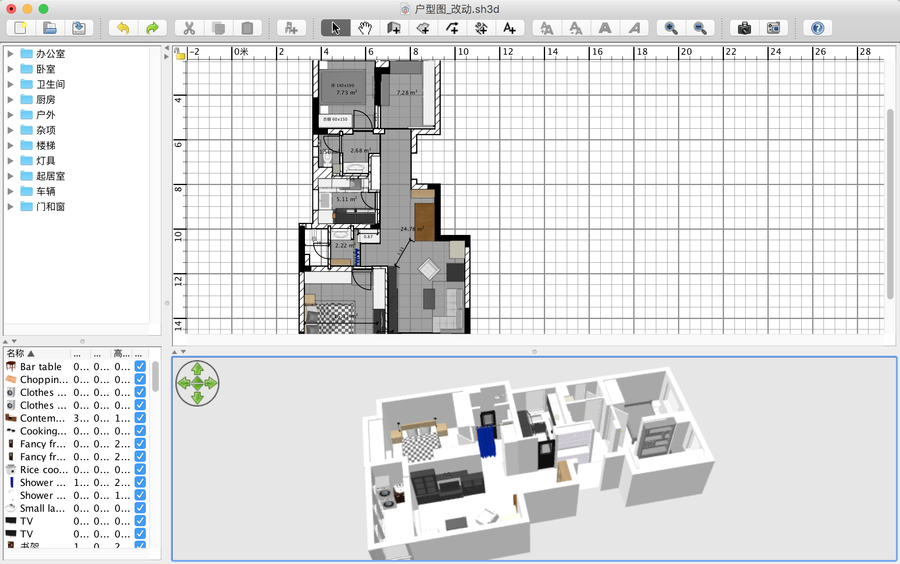
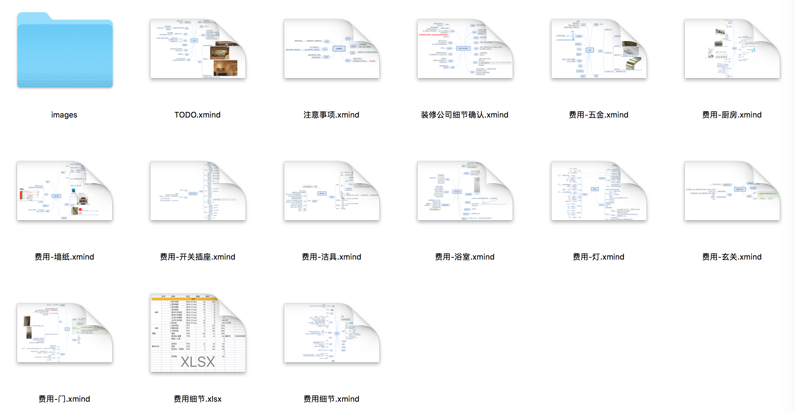

# 未名资源府89方小三居装修计划 beta_0.1

> 我的第一个房子，希望装修一个`日式实用型`的家，应该也会是最用心装修的一个房子

我的装修方案中几个比较特别的点：
> 1. 五金件尽量买好的，电器买稍好的，瓷砖地板等主材选择普通的
> 2. 对于海淘装修研究较多（见xmind)，如何海淘买浴室龙头花洒五金、燃气灶、燃气热水器、浴室门
> 3. 目前[0704]的研究主要针对主材和硬装，交房后准备半包装修。后续软装or家居风格还没有怎么研究

## 1. 户型图
1. 我使用的[sweet home 3D](http://www.sweethome3d.com/)做的户型图，尺寸是我自己去工地量的，不是完全的一致，大致差不多
2. 制作的材料见`户型图`文件夹

> 

## 2. [装修日记](Daily.md)
1. 记录每天看了什么
2. 之前几个月的修改直接保存到xmind文件里面了

## 3. tips
1. 见`费用/细节`文件夹

> 

